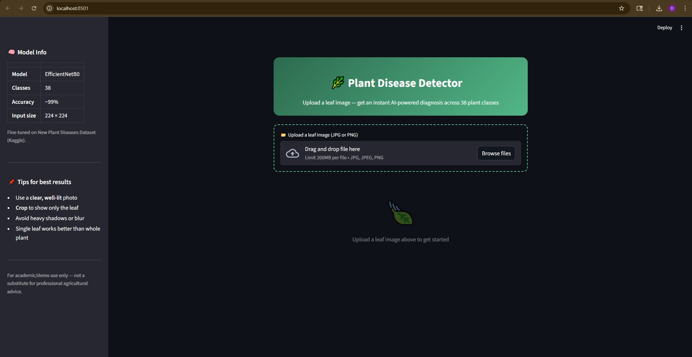
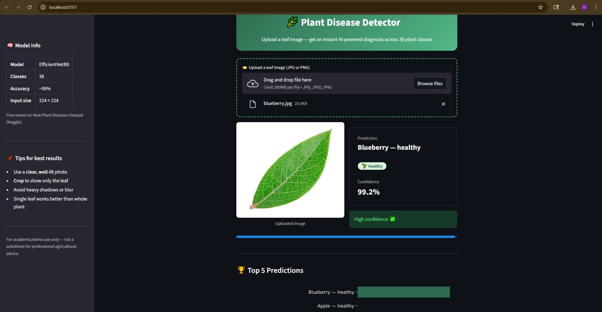
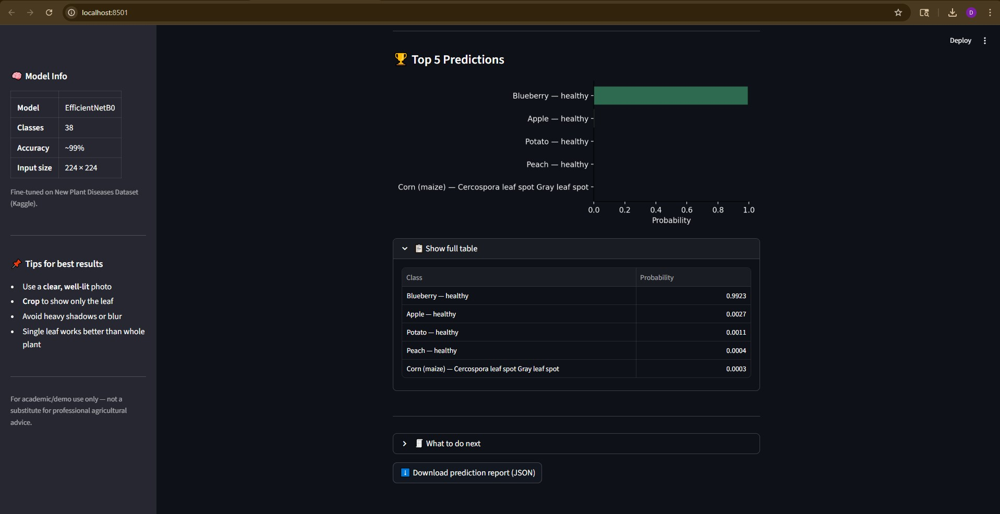
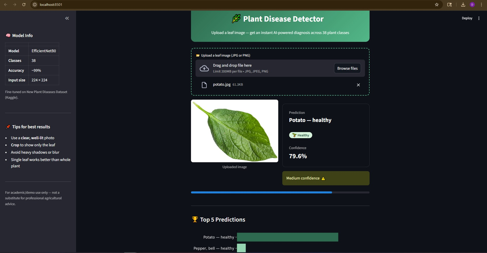
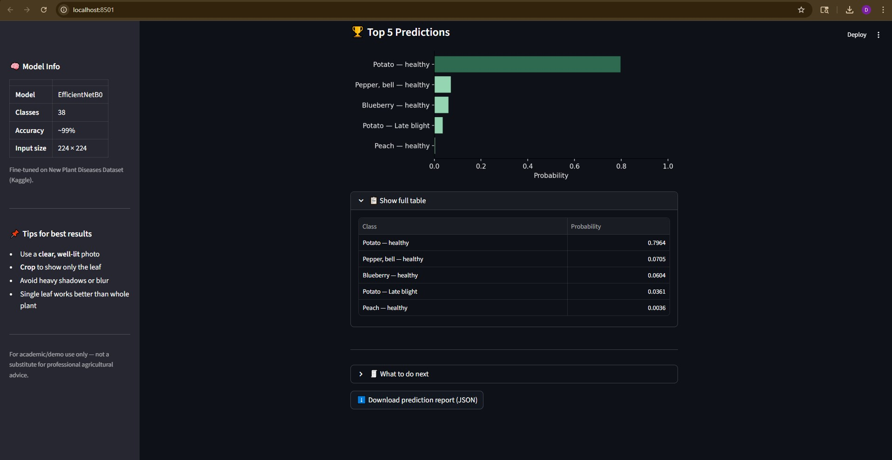
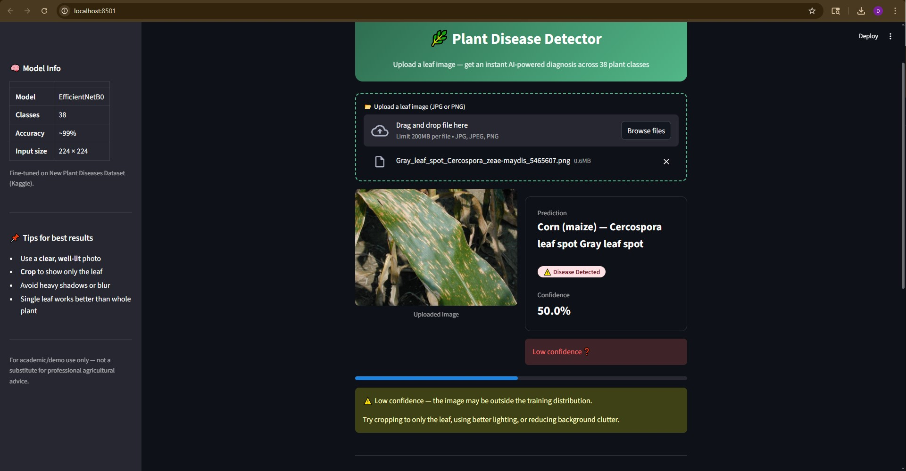
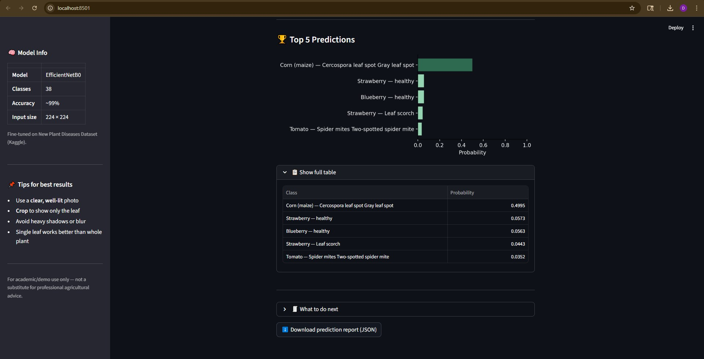

# 🌿 Plant Leaf Disease Detection
 


 
A deep learning project that classifies plant leaf images into **38 classes** (healthy + diseased) using Transfer Learning with TensorFlow/Keras. Includes a Streamlit web app for live predictions.
 
---
 
## 📸 Demo
 
> Upload a leaf image → get a disease prediction, confidence score, and top-5 results.
 
**Web App**

 
**Blueberry — Healthy**
| | |
|---|---|
|  |  |
 
**Potato — Healthy**
| | |
|---|---|
|  |  |
 
**Corn Detection**
| | |
|---|---|
|  |  |
 
---
 
## 🧠 Models
 
| Feature | Baseline | Improved |
|---|---|---|
| Backbone | MobileNetV2 | EfficientNetB0 |
| Fine-tuning | No | Yes (top 30% layers) |
| Augmentation | Basic | Stronger |
| Label smoothing | No | Yes (0.05) |
| Class weights | No | Yes |
| Test Accuracy | ~93% | ~99% |
 
---
 
## 📁 Project Structure
 
```
plant-disease-detection/
├── app/
│   └── app.py                  # Streamlit web app
├── src/
│   ├── config.py               # All paths and settings
│   ├── baseline_train.py       # Train baseline model (MobileNetV2)
│   ├── train_improved.py       # Train improved model (EfficientNetB0)
│   ├── evaluate.py             # Evaluate a model on test set
│   ├── gradcam.py              # Grad-CAM heatmap visualization
│   ├── make_test_split.py      # Creates test split from validation set
│   └── save_class_names.py     # Saves class names to JSON
├── models/
│   ├── baseline.keras
│   ├── improved_best.keras
│   └── class_names.json
├── outputs/
│   └── final/
│       ├── baseline/
│       └── improved/
├── test_evaluation.py
└── README.md
```
 
---
 
## 📦 Dataset
 
**Name:** New Plant Diseases Dataset (Augmented)  
**Classes:** 38 | **Source:** [Kaggle](https://www.kaggle.com/datasets/vipoooool/new-plant-diseases-dataset)
 
| Split | Usage |
|---|---|
| `train/` | Model training |
| `valid/` | Validation during training |
| `test/` | Final evaluation (20% per class from valid) |
 
> ⚠️ The dataset is **not included** in this repo. Download from Kaggle and update the path in `src/config.py`.
 
---
 
## 🚀 How to Run
 
### 1. Create & activate virtual environment
 
```bash
python -m venv plant_env
 
# Windows
plant_env\Scripts\activate
 
# Mac/Linux
source plant_env/bin/activate
```
 
### 2. Install dependencies
 
```bash
pip install -r requirements.txt
```
 
### 3. Update dataset path
 
Edit `src/config.py` and set `DATASET_ROOT` to your local dataset folder.
 
### 4. Train models
 
```bash
# Baseline
python src/baseline_train.py
 
# Improved
python src/train_improved.py
```
 
### 5. Evaluate
 
```bash
python -m src.evaluate models/improved_best.keras
```
 
### 6. Run the web app
 
```bash
streamlit run app/app.py
```
 
---
 
## 🔥 Grad-CAM
 
Visualizes which part of the leaf the model focuses on when making a prediction.
 
```bash
python -m src.gradcam models/improved_best.keras
```
 
Output is saved to `outputs/gradcam/`.
 
---
 
## 📊 Evaluation Outputs
 
Saved inside `outputs/final/`:
 
- `classification_report.txt` — per-class precision, recall, F1
- `per_class_metrics.csv` — same data in CSV format
- `confusion_matrix.png` — visual confusion matrix
---
 
## 🛠️ Tech Stack
 
- Python 3.10
- TensorFlow / Keras
- Streamlit
- scikit-learn
- Matplotlib / Seaborn
- Pillow
---
 
## 📝 Notes
 
- Dataset and virtual environment are **not** uploaded to GitHub.
- The improved model uses two-stage training: head first, then fine-tuning top 30% of EfficientNetB0.
- This project is for **academic/demo use only** — not a substitute for professional agricultural advice.
---
 
## 👩‍💻 Author
 
**Diksha Sirohi**  
[GitHub](https://github.com/DikshaSirohi)
 
---